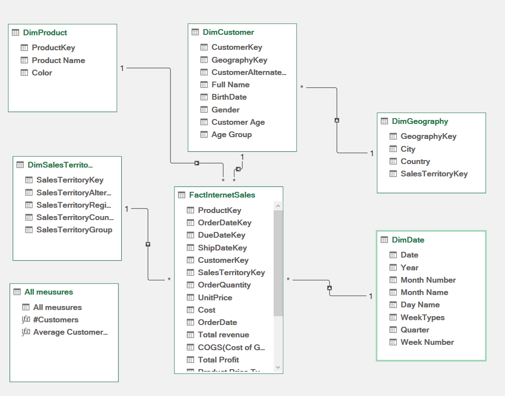
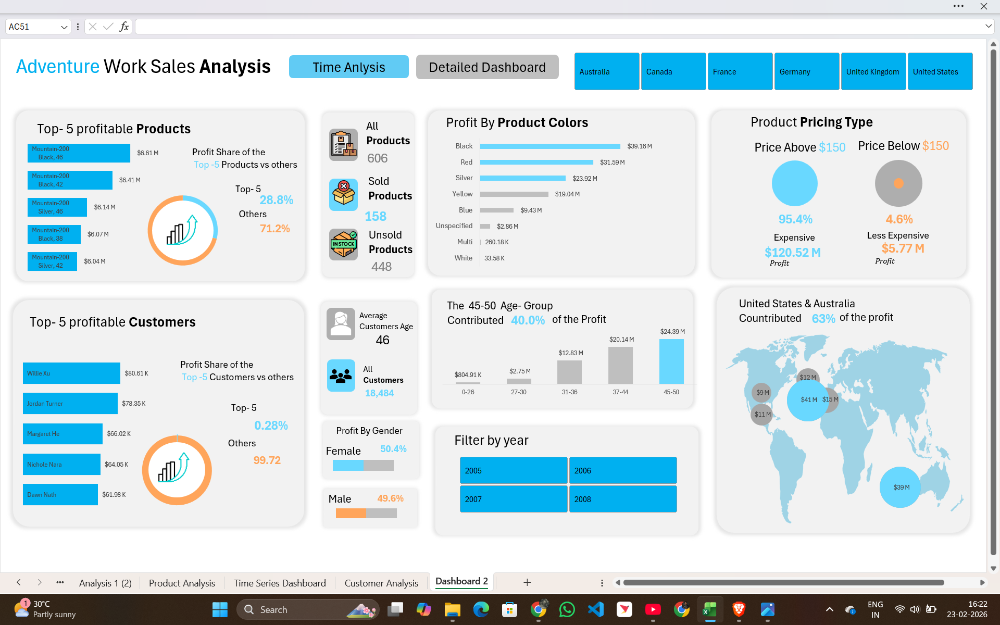
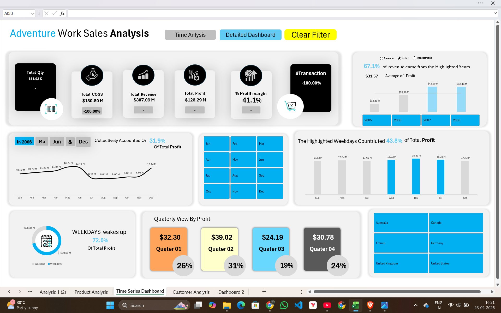

# 📊 Adventure Works Sales Analysis Dashboard

An interactive Excel-based Business Intelligence dashboard built using the **Adventure Works dataset**.  
This project demonstrates strong data modeling, KPI design, and analytical storytelling using a Star Schema approach.

---

## 🚀 Project Overview

The goal of this project is to transform raw transactional sales data into meaningful business insights through:

- Structured Data Modeling (Star Schema)
- KPI Development
- Time Series Analysis
- Customer & Product Profitability Analysis
- Geographic Performance Insights

This dashboard simulates a real-world Sales Analytics environment.

---

## 🏗️ Data Model (Star Schema)

The project follows a proper **Fact-Dimension architecture**:

- **Fact Table:** `FactInternetSales`
- **Dimension Tables:**
  - `DimProduct`
  - `DimCustomer`
  - `DimDate`
  - `DimGeography`
  - `DimSalesTerritory`

✔ One-to-Many relationships  
✔ Clean dimensional structure  
✔ Optimized for KPI calculations  

### 📌 Data Model Visualization

---

## 📈 Detailed Sales Dashboard

The main dashboard focuses on performance monitoring and profitability insights.

### 🔹 Key KPIs

- Total Revenue: **$307.09M**
- Total Profit: **$126.29M**
- Profit Margin: **41.1%**
- Total Quantity Sold
- Transaction Analysis

### 🔹 Business Insights

- 45–50 age group contributes highest share of profit
- Price Above $150 category drives majority profit
- United States & Australia are top contributors
- Weekdays generate significant portion of revenue

### 🔹 Interactive Features

- Country Filters
- Year Filters
- Product Profit Ranking
- Customer Profit Analysis
- Gender-Based Profit Insights
- Quarterly Profit View

### 📌 Dashboard Preview

---

## 📊 Time Series Dashboard

This dashboard focuses on trend analysis and revenue patterns over time.

### 🔹 Features

- Year Selection (2005–2008)
- Monthly Trend Analysis
- Weekday Contribution Analysis
- Quarterly Profit Breakdown
- Revenue & Transaction Trend Comparison

### 📌 Time Series Visualization

---

## 🛠️ Tools & Techniques Used

- Microsoft Excel
- Power Pivot
- Star Schema Data Modeling
- Pivot Tables
- KPI Design
- Interactive Slicers
- Time Intelligence Analysis

---

## 🎯 Key Learnings

- Designing scalable star schema models
- Creating business-ready KPI dashboards
- Improving analytical storytelling
- Building interactive executive-level dashboards
- Structuring portfolio-ready analytics projects

---

## 📂 Repository Structure

## 👨‍💻 About Me

Hi, I'm **Yogesh**, an aspiring Data Analyst passionate about transforming data into actionable insights.

📫 Connect with me on LinkedIn    
🔗 LinkedIn: [Yogesh](https://www.linkedin.com/in/yogesh-dhruw-031ba8321/)